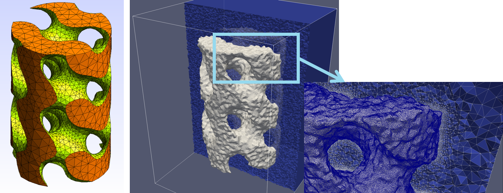

# BioDeg Preprocessor

This repository contains the source code of the postprocessor developed for the [BioDeg](https://github.com/mbarzegary/BioDeg-UI) corrosion and biodegradation software. Although it's a standalone tool developed in FreeFEM language, it's recommended for non-advanced users to use it as part of the BioDeg software.

This tool can be seen as a general tool to embed a mesh into another and perform a mesh refinement on the internal interface of the two. The figure below shows this process for embedding a gyroid-like shape into a cubic container, with mesh being refined on the interface of the gyroid mesh. This approach is widely used for the biodegradation simulations carried out using BioDeg. This tool uses Mmg and Tetgen internally to perform the mesh reconstruction and refinement.

